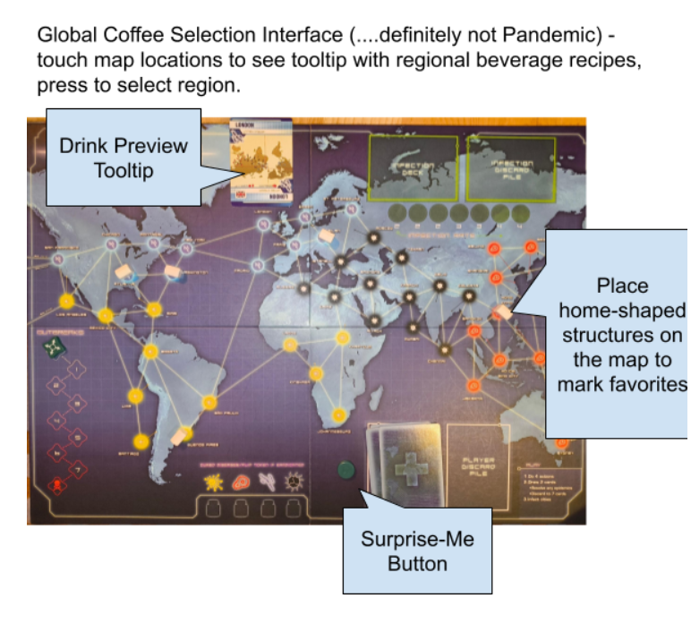

# Magical Interface 🪄

## User Day Story Interview 

For this project, I interviewed Brad.

In his narrative about his day, Brad's description of his coffee-making process was notably more detailed relative to descriptions of other activities.
Upon further discussion, Brad described his coffee making process as a "ritual", but something that he didn't always have the time for, and often encountered frustrating roadblocks (discovering he hadn't cleaned out the coffee grounds, not having set the timer right on his coffee maker, etc.) He also liked to "mix it up" each day, changing different variables (temperature, creamer amount and flavor, coffee variety). Brad was sensitive to the presentation of the beverage and wanted to carve out the time to really savor his morning coffee.

For his interface, my goal was for Brad to be able to experience coffees from around the world, in their local settings, prepared and served in a variety of regional fashions.

I wanted to make a physical version of the interface, so I looked around my house for any map-like objects that would provide the regional selection control. The Pandemic game board served this purpose, because it provided points for a discrete number of locations on the global map, as well as cards with location names to be physical simulations of tooltips.

### Interface Features
- **'Surprise me' button.** This was important to Brad because he didn't always want to need to make an elaborate choice before having his coffee, but he also wanted to explore.
- **Drink Preview Tooltip** Before selecting a given location, the tooltip allows you to view what beverage is on the menu for that area.
- **Favorites Marking** The physical 'research base', house-shaped tokens in Pandemic were used to mark Brad's favorite global coffees as he discovers them, for future enjoyment.
- **Involvement Level** The 'outbreak meter' track on the side of the board was co-opted to allow Brad to input the amount of involvement he wanted to participate in the ritual of making the coffee on a given day. Higher levels would indicate that there would be an educational component to his coffee experience, where Brad could learn the regional coffee preparation methods and make his own cup. This was added to allow Brad to be active in the coffee-making ritual when he had the energy, or dial it down for a day when he just wanted to enjoy a coffee without needing to put in the effort.

### Interface Image

