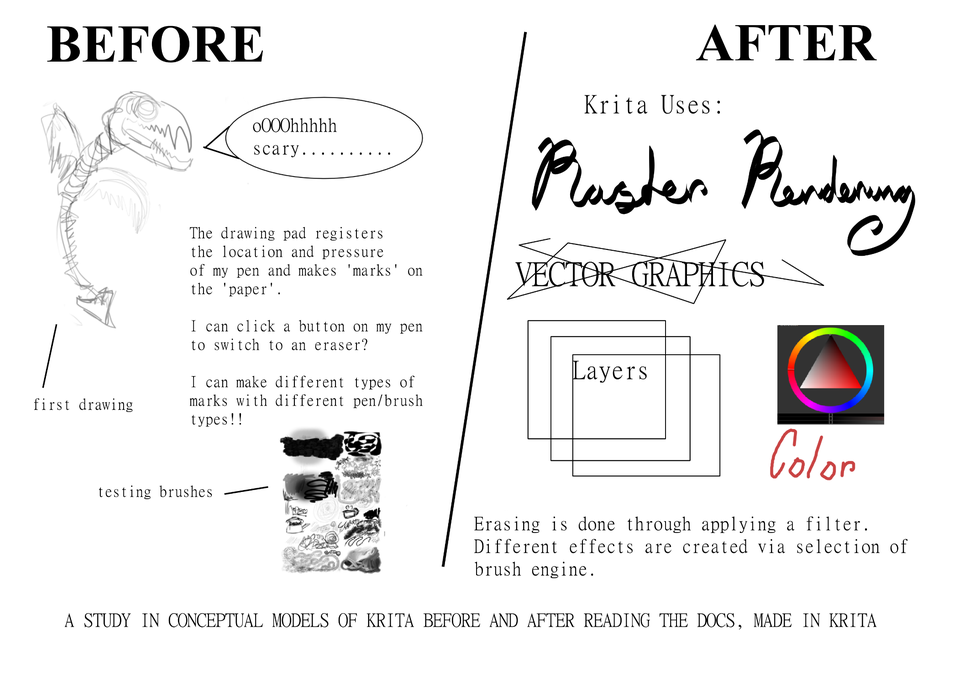

# Teach me, Teach You

### Visual Instruction Reflection
For the first part of Teach Me, Teach You, I got visual instructions from Flynn depicting how to fold an origami boat. My initial system image of my starting piece of paper and the possible action space of operations I could perform on the paper included ‘folding’ and ‘unfolding’. The first several steps felt intuitive, but then I could not figure out how to execute the transition from the 3rd to 4th steps. I tried several permutations of folds, but then realized that the arrows in this step indicated pulling outwards on the paper model, causing some of the paper flaps to lift and form a new shape. This altered my conceptual model of the available action space. In the next step, I got stuck again, but then realized the step required another similar pulling outwards, instead of more folds, which demonstrated my system image had expanded to include “pulling outwards” as a new type of origami “move”. Overall, Flynn’s steps were effective and I was able to complete the paper boat model without help, and end up with a modified conceptual model for origami.  

### SMART Goal
I would like to learn how to use digital illustration tools with a Wacom Tablet to create a piece of concept art for my ceramics project (I typically use physical media and have never made a digital illustration). I will make an illustration in color, with a “sketchy” style, to depict the concept for my ceramic orchid picture, including a color palette and scale bars. I will finish the drawing by class time on Wednesday.

### Learning Reflection

Exploration: I spent a while trying to get the original illustration software that was purported to come with my Wacom drawing tablet, but discovered to my dismay that the product key was expired 🙁
After doing a brief online search, Krita seemed like a good free illustration software alternative.
Installation was simple enough and I was able to set myself up with a blank canvas without any instructions. I then spent about half an hour just exploring the tool and trying to do things based on intuition. I was able to discover how to draw, erase, undo, redo, and change brush characteristics. My perception of the system and how it worked was largely carried over from drawing on paper with physical instruments. I was pleasantly surprised to find that the pressure I applied to the pen on the tablet would translate into thicker lines, just as it would on paper (and I later discovered that pressure-sensitive line weight could be modified through brush settings).

Documentation: At that point, I went to look at Krita’s Getting Started docs, which completely changed my system image. I learned that the program consisted of Images, which could be seen through different Views. Images were composed of Layers. Layers could contain Vector graphics or Raster renderings. I learned how to open the settings panels, called ‘Dockers’, for various tools, brushes, color selection, text editing, layer manipulation, and more.

### Revised SMART Goal
Based on what I learned, I decided it would be a more interesting SMART goal to try and use Krita to create the visual diagrams of my system image…of Krita.

### Conceptual Model

